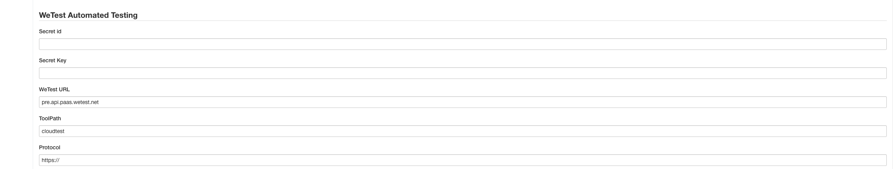
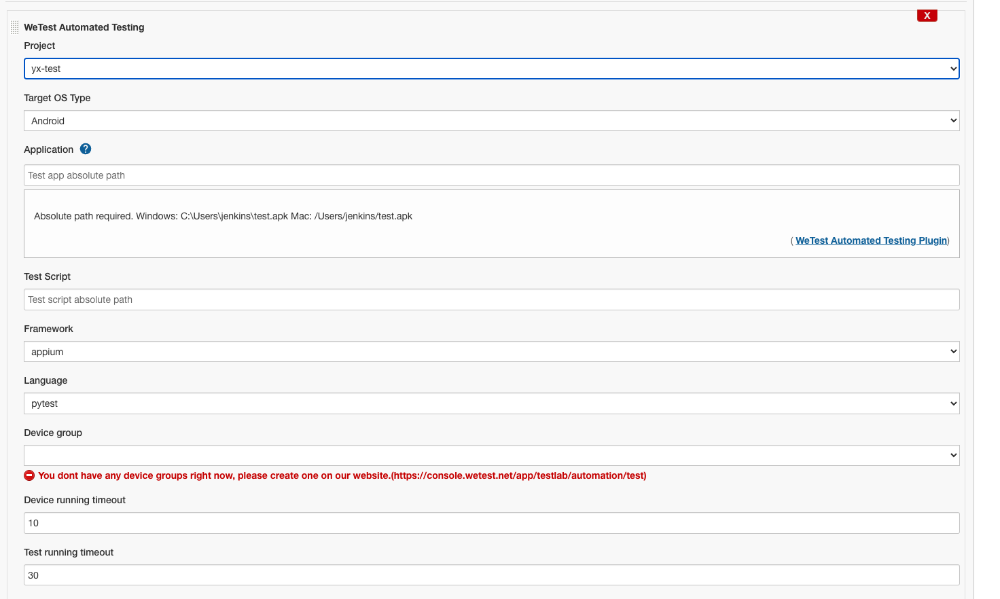

# WeTest Jenkins Integration

### 1. Install the Plugin

Install the WeTest plugin locally

* Download the plugin from our GitHub repository
* Install the plugin in Jenkins Plugin Management

### 2. Credential Settings

1. Go to **Manage Jenkins > Configure System**
2. Fill in the necessary information in the **WeTest Automated Testing** section. 
3. Click the  **Save** button to validate account details

**Secret id**: you can find it in your user settings

**Secret Key:** you can find it in your user settings

**WeTest URL**：pre.api.paas.wetest.net

**ToolPath**：cloudtest

**Protocol**：https:// 

### Build Step

Open an existing Jenkins job or create a new one. From the job configuration, add a new build step. (**Configure-Build--Add build step--WeTest Automated Testing**) 

To run automated tests , select a target project, and fill in the necessary information.

**Project**: Target project name for automated testing.

**Target OS Type**: OS, Android or iOS

**Application**: 

* Local absolute path required
* eg:
  * Windows: C:\Users\jenkins\test.apk
  * Mac: /Users/jenkins/test.apk

**Test Script**

* Local absolute path required
* eg:
  * Windows: C:\Users\jenkins\test.zip 
  * Mac: /Users/jenkins/test.zip

**Framework**：Testing Framework

**Device group**：A set of devices which is chosen by user and used for test running. If you do not have a device group yet, please create one on our website first.

**Advanced Setting**

* Device time-out period
  * The timeout of the each device running in your test. The default value is 10 minutes. 
* Test time-out period
  * The timeout of the this test run. The default value is 30 minutes. 

